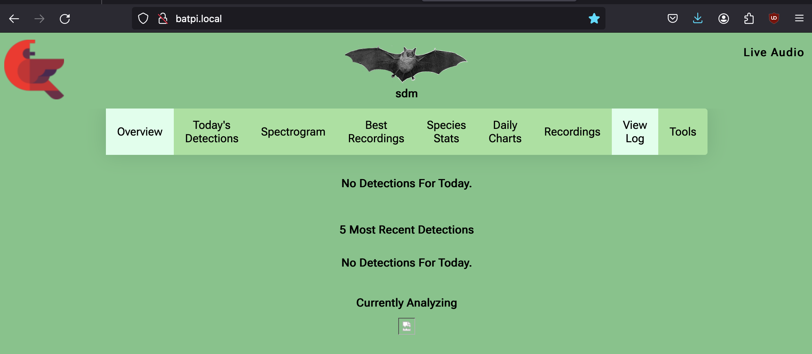
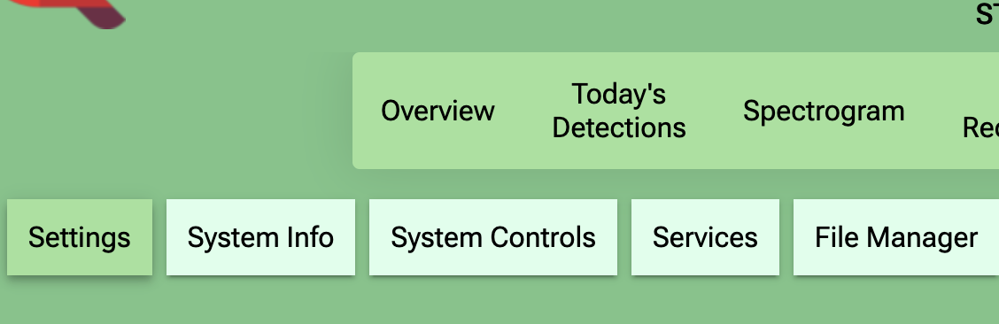

# Installation - 'easy'
&copy; Dr. Richard D. Zinck, 2024

BattyBirdNET-Pi can be installed in several ways including:
* **Easy install** using a pre-installed image of BattyBirdNET-Pi on RaspberryOS 64 bit light. Use The  [RaspberryPi Imager](https://www.raspberrypi.com/software/)  (available on Windows, Mac OS and Linux)
to burn the image on your SD card ready to go. Choose the BattyBirdNET-Pi image and use the configuration UI options from the [RaspberryPi Imager](https://www.raspberrypi.com/software/) to set a hostname, your region and WIFI details. 
Insert the SD card into the prepared hardware, wait three minutes and go to http://yourhostname.local in your browser.
**All in the UI, no Linux/RaspberryOS know-how required!**
* **Regular install** for people who can work with ssh on their systems and feel confident they can follow instructions on the commandline.
Choose your OS image (Raspberry 64 bit lite) and settings as you require. Start installation of the
system via the bash command provided in the README.md of the BattyBirdNET-Pi repository.
You can also use the 'easy' install and then log into the BattyBirdNET-Pi - the image is preconfigured with ssh enabled.

### Have all the parts ready
The RaspberryPi ecosystem offers a lot of options - e.g. you can build it into a system with a touch screen, a system with
a power pack included for on the go use and many more. The description here will be for a 'simple' station run from a fixed setting such
as your home. You will need:
1) A Raspberry Pi model 4 or 5 with 4 or 8 GB memory. **The model 5 is recommended**; especially if you want to use 384kHz 
sampling rate.
2) A case for the RaspberryPi that will provide cooling. The official Raspberry Pi enclosures work well for that and may include a fan.
The Pi 5 in particular should be run with active cooling, i.e. a fan in the enclosure.
3) A power plug for the Pi. You can use the official Raspberry Pi power plug or equivalent. Some power banks can also work.
4) An ultrasound microphone. **The Audiomoth USB with enclosure is recommended**. Will also work with the Audiomoth battery version
   (if USB driver is installed) and the Wildlife Acoustics Echo Meter Touch 2 in basic (EMT2, 256kHz) and Pro (384kHz) versions.
5) A cable to connect the ultra sound microphone to the USB A (blue) input of the Pi. The cable can have any length you require
   (tested up to 5m). The Audiomoth needs a micro USB male end (USB A - micro USB cable). The EMT2 requires a USB C male end in the cable (USB A - USB C cable).
6) An SD card. Go with high quality for many fast reads/writes and a large size (128 GB or larger) so that you can store many recordings.
The recordings are larger than regular audio files since they are sampled at much higher frequencies.

Finally, you need a computer (Windows, Mac, Linux, RaspberryOS) with an SD card reader/adapter and internet connection to flash the SD card.
There are also options to flash an SD card for RaspberryOS from an Android phone.


## Easy installation
### Preparation
**A)** Download and install the [RaspberryPi Imager](https://www.raspberrypi.com/software/) for your system 
([Windows](https://downloads.raspberrypi.org/imager/imager_latest.exe), 
[MacOS](https://downloads.raspberrypi.org/imager/imager_latest.dmg) or 
[Ubuntu](https://downloads.raspberrypi.org/imager/imager_latest_amd64.deb)).


**B)** Download the latest BattyBirdNET-Pi-RaspberryOS-64-bit-light [image](). Size is roughly 2GB.

### Step by step installation


1) Choose the device. The **Pi 5** also works for the Pi 4 so it is safe to choose that for both models.


2) Choose the image. Go all the way down to the last option, **'Use custom'**, and select the BattyBirdNET-Pi-RaspberryOS-64-bit-light-vX.X.X.img.xz from
your download location.


3) Choose storage: select your SD card. Make sure it is plugged into your system and visible (mounted). Push the 'next' button.


4) You will be asked if you want to configure your image. You do and go to 'Edit Settings'! Enter a 'hostname', 
the name of your local WIFI (SSID) and the WIFI password. It is important that you also provide your WIFI country information and 
the localization options (timezone, keyboard layout etc). The system will otherwise run into errors.
You do **not** have to provide a user name/password. The user 'bat' already exists on the system with default password 'batpwd'. SSH is
also already enabled, no action required. Enter the details and then  click 'Save'. You will come back to the customization question and answer 'Yes' this time.


5) Take the SD card from your computer and insert it into the Raspberry Pi **before** connecting the power cable.


6) Make sure you have the ultra sound microphone connected to the system ( into a blue USB A plug). Place the system in range of your WIFI 
and insert the power cable. The Pi 5 has an on/off button you can use instead of managing the power cable. Watch the Pi boot (lights are flashing) and wait three minutes. 
BattyBirdNET-Pi will start once, make a few adjustments, shut down and start automatically again.
Try calling http://batpi.local in a browser (replace 'batpi' by your hostname).


The BattyBirdNET-Pi page should load. 
You can also check the IP address in your router (look for connected devices). You can call that IP address directly from within your WIFI network.
Installing in this way sometimes leads to starting issues with the audio service. If the audio stream is not yet active, give the system some minutes. 



If there is no change, go to 'Tools' (user 'birdnet' - leave password empty) - 'Services'. Go to the bottom of the page and click 'Restart core services'.
Wait a few minutes. Go to the overview page and check. If it still did not work unplug and plug back in the microphone.
Wait two minutes. If there still should be issues, go to 'Tools' - 'System controls' and select reboot.If you made it this far, 
you will get it to work!


### Configure your BattyBirdNET-Pi

You should change a few settings starting with the location (lat/lon) and site name. The location is important
also to calculate the times of sunrise and sunset automatically for your site.
Also make sure to check if your time and date settings are correct.
Go to 'Tools' and log in with username 'birdnet'. Leave the password empty for now. You will change it later.





To make the system safer it is recommended to set a password for the web interface (username is fixed to 'birdnet'.)
Go to the bottom of the basic settings page. Find the advanced settings


Next, you can edit the settings of the classifier. The default settings activate the 'bavaria' classifier (European species)
at a sampling frequency of 256kHz. If you like different options you can set them in the Bat Classifier box
on the 'Advanced Settings' page.

The basic settings of the classifier 'minimum confidence' and 'sensitivity' are in the BirdnET Classifier box


The bat classifier specific options include choice of classifier ( Bavaria, USA-EAST, Uk, ...) 
and sampling frequency. The frequency needs to be supported by your microphone. It can be set from 256kHz ro 
384kHz. The audiomoth can be set to 'default' with the hardware slider on the device. It then is set to 384kHz and medium gain
and can be used immediately. If you choose a lower frequency in BattyBirdNET-Pi it will automatically downsample
the audio.

You can activate the timer which stops the classification between dawn and dusk. The system remains accessible during that time.
If you set the lat/lon earlier, the time of sunrise and sundown can be calculated automatically.
Further, you can activate bird detection during the day if you like.

You can also try the noise reduction by choosing the right profile for your microphone and setting the activation option.
Play with thre reduction factor ans see if it suits you.


## Troubleshooting

Many issues can be resolved by going to  'Tools' -'Services' and restarting 'Restart core services'.
If you know a bit of Linux and still have issues you can enter the terminal via 'Tools' - 'Web Terminal'. Username is 'bat' and password 'batpwd'. You can make any changes you like.
For debugging, you can try some of the following commands:
```sh
journalctl -eu birdnet_analysis -u birdnet_server -u batnet_server | sudo tee -a /var/log/syslog
cat /var/log/syslog  | grep error
ss -nltp
/usr/local/bin/print_diagnostic_info.sh
```
